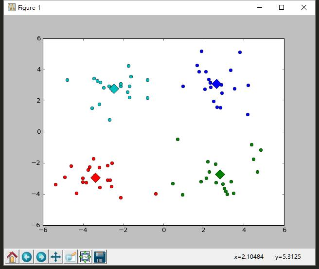

# k-Means 

---

k-means是一种聚类算法(clustering)。

它是应用于无监督学习中的一个典型、基础的算法。它是发现给定数据集上的k个簇的算法，k是用户输入指定的，每一个簇通过其质心(controid)，簇中所有点的中心，来描述。

## 算法过程及思想

 先随机出k个质心。然后为每一个点找其距离最近的质心，并将其分配给该质心所对应的簇。完成这一步骤之后，每个簇的质心更新为该簇的所有点的平均值。迭代进行此步骤，直到所有点不再更改它所属的簇，或者达到我们所需要的精度。

**优点：**算法简单、容易实现。

**缺点：**可能收敛到局部最小值，在大规模数据集上的收敛比较慢。(在测试数据集上就发现有陷入最小值的情况)

## 使用后处理提高聚类性能

待补。

收敛性证明。

图像分割应用

## 效果

 

其实，有时候很容易陷入局部最优解的，朴素的来做，效果确实不好。

## notes

kMeans.py为核心程序，加载数据，运行算法，展示效果(只支持二维的数据展示)

main.py 测试程序

data.txt 测试数据(80个二维的点)

